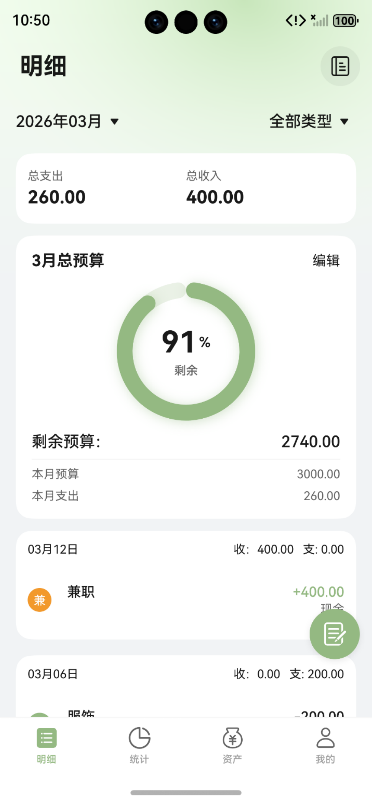
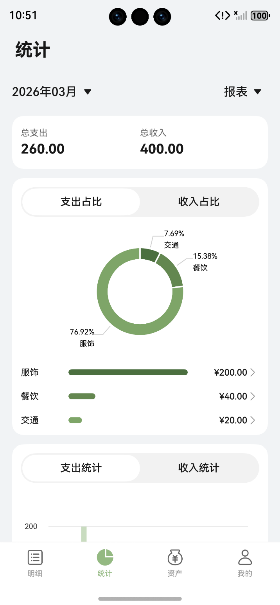
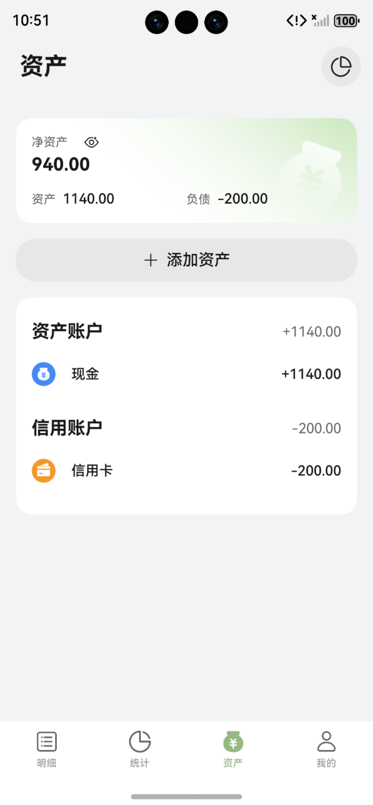
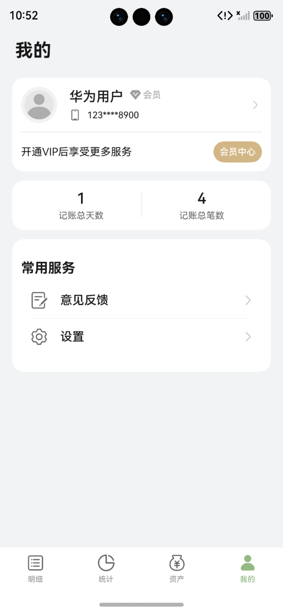
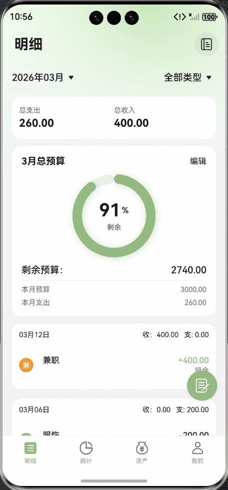

# 金融理财（记账）应用模板快速入门

## 目录

- [功能介绍](#功能介绍)
- [约束和限制](#约束和限制)
- [快速入门](#快速入门)
- [示例效果](#示例效果)
- [开源许可协议](#开源许可协议)


## 功能介绍

您可以基于此模板直接定制应用，也可以挑选此模板中提供的多种组件使用，从而降低您的开发难度，提高您的开发效率。

此模板提供如下组件，所有组件存放在工程根目录的components下，如果您仅需使用组件，可参考对应组件的指导链接；如果您使用此模板，请参考本文档。

| 组件                   | 描述                                                         | 使用指导                                        |
| ---------------------- | ------------------------------------------------------------ | ----------------------------------------------- |
| 资产卡片(asset_card)   | 提供了资产列表卡片和资产总览卡片，支持隐匿展示，自定义样式等相关能力。 | [使用指导](./components/asset_card/README.md)   |
| 资产管理(asset_manage) | 提供了资产管理和资产类型管理组件，支持作为组件嵌入或作为模态弹框拉起。 | [使用指导](./components/asset_manage/README.md) |
| 账单卡片(bill_card)    | 提供了账单卡片、账单总览卡片和账单详情卡片。支持自定义样式、事件处理等能力。 | [使用指导](./components/bill_card/README.md)    |
| 账单图表(bill_chart)   | 提供了多种类型的图表展示账单数据分析。包括饼图、金额排行图、月度柱状图、数据报表、日历视图。 | [使用指导](./components/bill_chart/README.md)   |
| 账单管理(bill_manage)  | 提供了账单管理和账单来源管理组件，支持作为组件嵌入或作为模态弹框拉起。 | [使用指导](./components/bill_manage/README.md)  |


本模板为记账类应用提供了常用功能的开发样例，模板主要分首页、统计和资产三大模块：

- 首页：主要展示账单列表，支持根据月份和类型进行账单筛选，支持点击悬浮按钮添加账单，编辑账单类型等常用功能。

- 统计：根据账单展示统计图表，支持根据月份筛选，支持展示饼图、金额排行、月度柱状图、统计报表、日历图等。

- 资产：主要展示资产列表，支持用户添加、编辑资产信息，支持在对应资产内完成记账等功能。

**本模版当前采用本地数据库存储账单、分类等数据，应用卸载后数据会被清空并且无法找回。**

| 首页                                                  | 统计                                                       | 资产                                                   | 我的                                                  |
| ----------------------------------------------------- | ---------------------------------------------------------- | ------------------------------------------------------ |-----------------------------------------------------|
|  |  |  |  |

本模板主要页面及核心功能如下所示：

```ts
记账模板
 |-- 首页
 |    |-- 账单查询
 |    |-- 新增账单
 |    |-- 账单类型管理
 |    |-- 编辑账单
 |    |-- 删除账单
 |    |-- 账单详情查看
 |    |-- 账本管理
 |    |-- 新增账本
 |    |-- 编辑账本
 |    |-- 删除账本
 |    |-- 账本详情查看
 |    └-- 编辑月度预算
 |-- 统计
 |    |-- 账单报表查看
 |    |-- 账单分类查看
 |    └-- 日历视图
 |-- 资产
 |    |-- 资产查询
 |    |-- 新增资产
 |    |-- 编辑资产
 |    |-- 删除资产
 |    |-- 资产内记账
 |    └-- 资产分析
 └-- 我的
      |-- 账号登录
      |-- 个人信息展示
      |-- 会员中心     
      |     └-- 开通/续费会员
      |-- 记账信息
      |-- 意见反馈
      └-- 设置
```

本模板工程代码结构如下所示：

```ts
MoneyTrack
|--commons                                      // 公共能力层
|   |--commonlib                                // 基础能力包
|   | └--src/main
|   |     |--ets
|   |     |   |--components                     // 公共组件
|   |     |   |--constants                      // 公共静态变量
|   |     |   |--dialogs                        // 公共弹窗
|   |     |   └--utils                          // 公共方法
|   |     |
|   |     └-- resources                         // 全局资源
|   |
|   └--lib_network
|     └--src/main
|         └--ets
|             |--constants                      // 常量
|             |--https                          // 网络请求封装
|             |--httpsmock                      // 网络请求本地mock
|             └--types                          // 网络请求、响应数据类型
|
|--components                                   // 可分可合组件包
|   |-- aggregated_login                        // 通用登录组件
|   |-- app_setting                             // 通用应用设置组件
|   |-- asset_base                              // 资产通用基础包
|   |-- asset_card                              // 资产卡片
|   |-- asset_manage                            // 资产管理
|   |-- bill_base                               // 账单通用基础包
|   |-- bill_card                               // 账单卡片
|   |-- bill_chart                              // 账单图表
|   |-- bill_data_processing                    // 账单数据处理
|   |-- bill_manage                             // 账单管理
|   |-- collect_personal_info                   // 通用个人信息组件
|   |-- feedback                                // 通用意见反馈组件
|   |-- memebership                             // 通用会员组件
|   └-- module_ui_base                          // 组件通用层
|
|--features                                     // 基础特性层
|   |-- assets                                  // 资产
|   |   └--src/main/ets/views
|   |      |--AddAssetPage.ets                  // 添加资产页
|   |      |--AssetAnalysisPage.ets             // 资产分析页
|   |      |--AssetDetailPage.ets               // 资产详情页
|   |      └--AssetsView.ets                    // 资产页
|   |-- home                                    // 首页明细
|   |   └--src/main/ets/views
|   |      |--AccountBookDetailPage.ets         // 账本详情页
|   |      |--AccountBookPage.ets               // 账本页
|   |      |--BillDetailPage.ets                // 账单详情页
|   |      |--HomeView.ets                      // 首页
|   |      └--ResourceManagePage.ets            // 分类管理页
|   |-- mine                                    // 我的
|   |   └--src/main/ets/views
|   |      |--EditProfilePage.ets               // 用户信息编辑页
|   |      |--LoginPage.ets                     // 登录页
|   |      |--MemberSubscriptionPage.ets        // 开通会员页
|   |      |--MineView.ets                      // 我的页
|   |      └--SettingPage.ets                   // 设置页
|   └-- statistics                              // 统计
|       └--src/main/ets/views
|          |--BillByResourceView.ets            // 分类账单详情
|          └--StatisticsView.ets                // 统计页
|
└--products                                     // 设备入口层
    └-- entry
        └--src/main/ets
           |-- pages
           |   └-- MainEntry.ets                // 主入口
           └-- widgets
               |-- MiddleCard.ets               // 2*4中号卡片
               └-- MiniCard.ets                 // 2*2小号卡片
```


## 约束和限制

### 环境

- DevEco Studio版本：DevEco Studio 6.0.0 Release及以上
- HarmonyOS SDK版本：HarmonyOS 6.0.0 Release SDK及以上
- 设备类型：华为手机（包括双折叠和阔折叠）、华为平板
- 系统版本：HarmonyOS 6.0.0(20)及以上

### 权限

- 网络权限：ohos.permission.INTERNET

## 快速入门

### 配置工程

在运行此模板前，需要完成以下配置：

1. 在AppGallery Connect创建应用，将包名配置到模板中。

   a. 参考[创建HarmonyOS应用](https://developer.huawei.com/consumer/cn/doc/app/agc-help-create-app-0000002247955506)为应用创建APP ID，并将APP ID与应用进行关联。

   b. 返回应用列表页面，查看应用的包名。

   c. 将模板工程根目录下AppScope/app.json5文件中的bundleName替换为创建应用的包名。

2. 配置华为账号服务。

   a. 将应用的client ID配置到entry/src/main路径下的module.json5文件中，详细参考：[配置Client ID](https://developer.huawei.com/consumer/cn/doc/harmonyos-guides/account-client-id)。

   b. 申请华为账号一键登录所需的quickLoginMobilePhone权限，详细参考：[配置scope权限](https://developer.huawei.com/consumer/cn/doc/harmonyos-guides/account-config-permissions)。

3. 配置应用内支付服务

   a. 您需[开通商户服务](https://developer.huawei.com/consumer/cn/doc/start/merchant-service-0000001053025967)才能开启应用内购买服务。商户服务里配置的银行卡账号、币种，用于接收华为分成收益。

   b. 使用应用内购买服务前，需要打开应用内购买服务(HarmonyOS NEXT) 开关，此开关是应用级别的，即所有使用IAP Kit功能的应用均需执行此步骤，详情请参考[打开应用内购买服务API开关](https://developer.huawei.com/consumer/cn/doc/app/switch-0000001958955097)。

   c. 开启应用内购买服务(HarmonyOS NEXT) 开关后，开发者需进一步激活应用内购买服务 (HarmonyOS NEXT)，具体请参见[激活服务和配置事件通知](https://developer.huawei.com/consumer/cn/doc/app/parameters-0000001931995692)。

   d. 由于真实支付需依赖应用及其关联的会员商品上架，故建议在接入华为应用内支付调测过程中，您可以使用[沙盒测试](https://developer.huawei.com/consumer/cn/doc/harmonyos-guides/iap-sandbox)对订单进行虚拟支付。

4. 对应用进行[手工签名](https://developer.huawei.com/consumer/cn/doc/harmonyos-guides/ide-signing#section297715173233)。

5. 添加手工签名所用证书对应的公钥指纹。详细参考：[配置应用签名证书指纹](https://developer.huawei.com/consumer/cn/doc/app/agc-help-cert-fingerprint-0000002278002933)

### 运行调试工程

1. 连接调试手机和PC。

2. 菜单选择“Run > Run 'entry' ”或者“Run > Debug 'entry' ”，运行或调试模板工程。

## 示例效果




## 开源许可协议

该代码经过[Apache 2.0 授权许可](http://www.apache.org/licenses/LICENSE-2.0)。